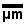

# imagej-tools

Some useful macros and tools for calibration and annotations of micrographs.

## Installation

Copy the content of `macros\toolsets` into the `Fiji.app\macros\toolsets` directory

Copy the `plugins\AnnoTools` directory into the `Fiji.app\plugins`

### Requirements
Tested with ImageJ/Fiji version `1.58t`

`TIFF Dumper` plugin for reading the image metadata

`Bio-Formats` plugins for reading images from Jeol (this plugin is part of the Fiji distribution)

## Usage

Macros can be found under two additional toolsets accessible by the `>>` button on the right.

### Calibration

Load `.tif`/`.dm4` image into ImageJ and run the corresponding macro from the `CalTools` toolbar. Calibrated copies of all images are saved in the original imagage directory with `cal_` prefix.

 Calibration of FEI Quanta, crops the bottom databar

 Calibration of Zeiss Auriga, crops nothing - use on the PlainImages

 Calibration of ThermoFisher Apreo, crops the bottom databar

 Calibration of images from old Jeol (Olympus camera), imaging / diffraction mode is recognized and correct unit assigned

 Calibration of images from new Jeol (Gatan camera), imaging / diffraction mode is recognized and correct unit assigned. Use `.dm4` file.

 Calibration of Zeiss Axio Observer, currently does not work very well

### Annotation

 General annotation of micrographs. Scale of all elements (scalebar, font size) is calculated with respect to the image width, i.e. two same-width images side by side will have annotations of the same size. Setting column toggle to `1` will make the annotations half the size (for screen-/paper-wide presentation). Reasonable size of the scalebar is suggested. Upper left label should be used for subfigure labeling (a,b,c...), upper right label is intended for sample labeling (will accept longer text). Selecting orientation triangle will add correpsonding high-resolution EBSD orientation triangle to the bottom right corner. Default saving as PNG.

 Simple tool to add greek letters as annotation (which is not possible otherwise). Use LaTeX syntax for greek letters, `^2`, `^3`, `_1`, `_2` and `_3` sub- and superscripts can be printed as well. Font size is the same as used for annotations, white color. Position: At Selection

 One-click `Save As PNG`. Shortcut for image export defaulting to the image directory, so it is not necessary to look up this function in the menu.

 Process APEX-created EDS maps in one folder. The script gets calibration, crops the bottom databar and saves the maps as `.png` and calibrated `.tif`. Scalebar can be added, the images can be labeled by the respective X-ray line (taken from the filename) and filename prefix can be added to the processed images.

